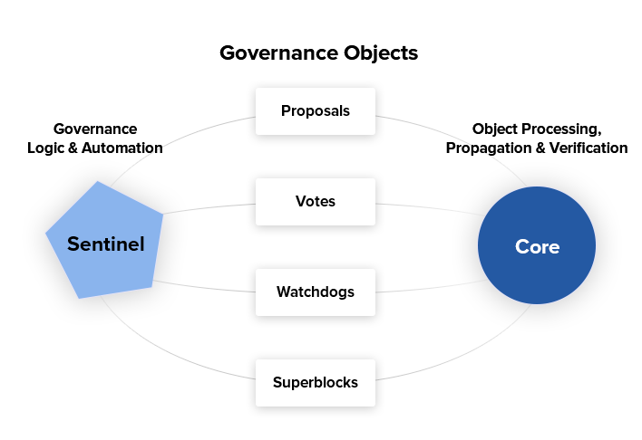

# Features

## Specifications

* Genesis Block mined at 9AM UTC, 11th August 2019
* No premine, ICO or developer fees/rewards
* x25x hashing algorithm
* 2 minute block time and 2MB block size
* Dark Gravity Wave difficulty adjustment algorithm
* Between 21.25M and 22.75M total coin supply
* Decentralized second-tier masternode network
* Protection against 51% attacks using ChainLocks
* Self funded governance system backed by masternode owners votes on proposals

## Masternodes

In addition to traditional Proof of Work \(PoW\) rewards for mining Umbru, users are also rewarded for running and maintaining special servers called masternodes. Thanks to this innovative two tier network, Umbru can offer innovative features in a trust-less and decentralized way. Masternodes are currently used to power the governance and treasury system. Users are rewarded for running masternodes; starting at 20% of the block reward increasing 5% monthly until 50% is allocated to pay the masternode network. You can view practical guides on all topics relating to masternodes [here](../network/masternodes.md).

Masternodes enable the following services:

* **ChainLocks**, which protects the Umbru blockchain against 51% mining attacks by signing blocks as they are mined.
* **Governance and Treasury** allows masternode holders to determine the direction of the project and devotes 10% of the block reward to development of the project and ecosystem.

Masternode owners must have possession of 5000 UMBRU, which they prove by signing a message included in a special transaction written to the blockchain. The Umbru can be moved or spent at any time, but doing so will cause the masternode to fall out of queue and stop earning rewards. Masternode users are also given **voting rights** on proposals. Each masternode has one vote and this vote can be used on budget proposals or important decisions that affect Umbru.

Masternodes cost money and effort to host so they are paid a percentage of the block reward as an incentive. Because only one masternode is paid in each block, the frequency of the payment can vary, as well as the value of the Umbru paid out. There is also the possibility for masternodes to earn money from fees in the future.

## ChainLocks

ChainLocks are a feature provided by the Umbru Network which provides certainty when accepting payments. This technology creates an environment in which payments can be accepted immediately and without the risk of “Blockchain Reorganization Events”.

The risk of blockchain reorganization is typically addressed by requiring multiple “confirmations” before a transaction can be safely accepted as payment. This type of indirect security is effective, but at a cost of time and user experience. ChainLocks are a solution for this problem.

Every twelve hours a new “LLMQ” \(Long-Lasting Masternode Quorum\) is formed using a “DKG” \(Distributed Key Generation\) process. All members of this Quorum are responsible for observing, and subsequently affirming, newly mined blocks:

1. Whenever a block is mined, Quorum Members will broadcast a signed message containing the observed block to the rest of the Quorum.
2. If 60% or more of the Quorum sees the same new block they will collectively form a “CLSIG” \(ChainLock Signature\) message which will be broadcast to the remainder of the network.
3. When a valid ChainLock Signature is received by a client on the network, it will reject all blocks at the same height that do not match the block specified in that message.

The result is a quick and unambiguous decision on the “correct” blockchain for integrated clients and wallets. From a security perspective, this also makes reorganizations prior to this block impossible.

## Sporks

Sporks are an innovation that allows for far smoother transitions than in the traditional hard fork paradigm, as well as the collection of test data in the live network environment. This process of multi-phased forking was originally to be called “soft forking” but the community affectionately dubbed it “the spork” and the name stuck.

New features or versions of Umbru undergo extensive testing on testnet before they are released to the main network. When a new feature or version of Umbru is released on mainnet, communication is sent out to users informing them of the change and the need for them to update their clients. Those who update their clients run the new code, but it is not activated until a sufficient percentage of network participants \(usually 80%\) reach consensus on running it. In the event of errors occurring with the new code, the client’s blocks are not rejected by the network and unintended forks are avoided. Data about the error can then be collected and forwarded to the development team. Once the development team is satisfied with the new code’s stability in the mainnet environment – and once acceptable network consensus is attained – enforcement of the updated code can be activated remotely by multiple members of the core development team signing a network message together with their respective private keys. Should problems arise, the code can be deactivated in the same manner, without the need for a network-wide rollback or client update.

## Dark Gravity Wave

DGW or Dark Gravity Wave is an open source difficulty-adjusting algorithm for Bitcoin-based cryptocurrencies that was first used in Dash and has since appeared in other digital currencies. DGW was authored by Evan Duffield, the developer and creator of Dash, as a response to a time-warp exploit found in _Kimoto’s Gravity Well_. In concept, DGW is similar to the Kimoto Gravity Well, adjusting the difficulty levels every block \(instead of every 2016 blocks like Bitcoin\) based on statistical data from recently found blocks. This makes it possible to issue blocks with relatively consistent times, even if the hashing power experiences high fluctuations, without suffering from the time-warp exploit.

* Version 2.0 of DGW was implemented in Dash from block 45,000 onwards in order to completely alleviate the time-warp exploit.
* Version 3.0 was implemented on May 14 of 2014 to further improve difficulty re-targeting with smoother transitions. It also fixes issues with various architectures that had different levels of floating-point accuracy through the use of integers.

## Decentralized Governance

Decentralized Governance, is Umbru's choice on how to solve two important problems in cryptocurrency: governance and funding. Governance in a decentralized project is difficult, because by definition there are no central authorities to make decisions for the project. In Umbru, such decisions are made by the network, that is, by the owners of masternodes. The governance system allows each masternode to vote once \(yes/no/abstain\) for each proposal. If a proposal passes, it can then be implemented \(or not\) by Umbru's developers.

The governance system also provides a means for Umbru to fund its own development. While other projects have to depend on donations or premines, Umbru uses 10% of the block reward to fund its own development. Every time a block is mined, 10% is removed and held in 'escrow' on the blockchain and is not created until the end of the month. During the month, anybody can make a budget proposal to the network. If that proposal receives net approval of at least 10% of the masternode network, then at the end of the month a series of “superblocks” will be created. At that time, the block rewards that were not paid out \(10% of each block\) will be used to fund approved proposals. The network thus funds itself by reserving 10% of the block reward for budget projects.

## Sentinel

Sentinel is an autonomous agent for persisting, processing and automating Umbru governance objects and tasks. Sentinel is implemented as a Python application that binds to a local version umbrud instance on each Umbru masternode.

A Governance Object \(or “govObject”\) is a generic structure that allows for the creation of Budget Proposals and Triggers. Class inheritance has been utilized to extend this generic object into a “Proposal” object to supplant the current Umbru budget system.

